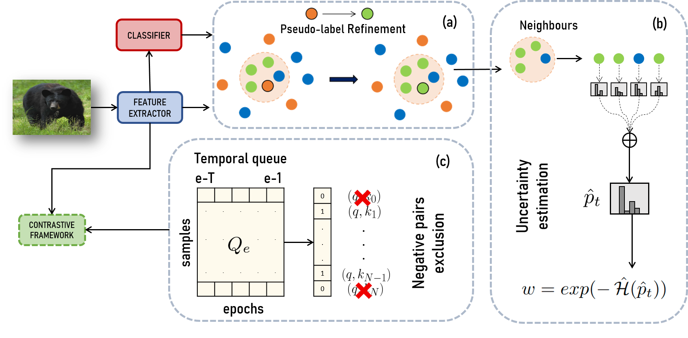
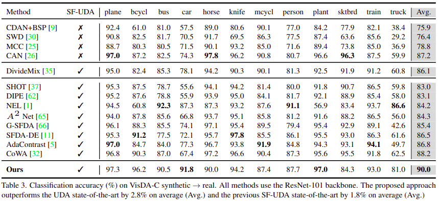
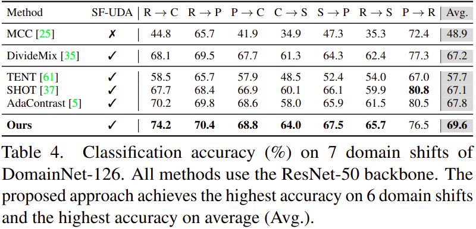

# Guiding Pseudo labels with Uncertainty Estimation for Source-free Unsupervised Domain Adaptation (CVPR 2023)

This is the official implementation of the CVPR 2023 paper "**Guiding Pseudo-labels with Uncertainty Estimation for Source-free Unsupervised Domain Adaptation**" - _Mattia Litrico, Alessio Del Bue, Pietro Morerio_.

https://arxiv.org/abs/2303.03770

```
@inproceedings{litrico_2023_CVPR,
  title={Guiding Pseudo-labels with Uncertainty Estimation for Source-free Unsupervised Domain Adaptation},
  author={Litrico, Mattia and Del Bue, Alessio and Morerio, Pietro},
  booktitle={Proceedings of the IEEE/CVF Conference on Computer Vision and Pattern Recognition (CVPR)},
  year={2023}
}
```

## Abstract



Standard Unsupervised Domain Adaptation (UDA) methods assume the availability of both source and target data during the adaptation. In this work, we investigate Source-free Unsupervised Domain Adaptation (SF-UDA), a specific case of UDA where a model is adapted to a target domain without access to source data. We propose a novel approach for the SF-UDA setting based on a loss reweighting strategy that brings robustness against the noise that inevitably affects the pseudo-labels.
The classification loss is reweighted based on the reliability of the pseudo-labels that is measured by estimating their uncertainty. Guided by such reweighting strategy, the pseudo-labels are progressively refined by aggregating knowledge from neighbouring samples. 
Furthermore, a self-supervised contrastive framework is leveraged as a target space regulariser to enhance such knowledge aggregation. A novel negative pairs exclusion strategy is proposed to identify and exclude negative pairs made of samples sharing the same class, even in presence of some noise in the pseudo-labels.
Our method outperforms previous methods on three major benchmarks by a large margin. We set the new SF-UDA state-of-the-art on VisDA-C and DomainNet with a performance gain of +1.8\% on both benchmarks and on PACS with +12.3\% in the single-source setting and +6.6\% in\ multi-target adaptation. Additional analyses demonstrate that the proposed approach is robust to the noise, which results in significantly more accurate pseudo-labels compared to state-of-the-art approaches.


### Data Preparation
1. Please download the [VisDA-C](https://github.com/VisionLearningGroup/taskcv-2017-public/tree/master/classification) and [DomainNet](http://ai.bu.edu/M3SDA/) dataset, and put it under ```${DATA_ROOT}```. 
By default ```${DATA_ROOT}``` is set to ```data```.
The prepared directory would look like:
```
${DATA_ROOT}
├── VISDA-C
│   ├── train
│   ├── validation
```

2. Please download the [DomainNet](http://ai.bu.edu/M3SDA/) dataset, and put it under ```${DATA_ROOT}```. 
Notice that we follow MME to use a subset that contains 126 classes from 4 domains, so we also compiled .txt files for your convenience based on the the image labels, provided under ./datasets/domainnet-126/
The prepared directory would look like:
```
${DATA_ROOT}
├── domainnet-126
│   ├── real
│   ├── sketch
│   ├── clipart
│   ├── painting
│   ├── real_list.txt
│   ├── sketch_list.txt
│   ├── clipart_list.txt
│   ├── painting_list.txt
```
## VisDA-C

###  Training

VISDA-C experiments are done for ```train``` to ```validation``` adaptation. 
Before the test-time adaptation, we should have the source model. 
You may train the source model with script ```train_VISDA-C_source.sh``` as shown below.
After obtaining the source models, you will find model weights inside the directory ```logs```. 
Now run train_VISDA-C_target.sh to execute test-time adaptation.

```
# train source model
bash train_VISDA-C_source.sh

# train TTA
bash train_VISDA-C_target.sh
```

If you want to change the default ```${DATA_ROOT}```, please use the following:

```
# train source model
bash train_VISDA-C_source.sh <DATA_ROOT>

# train TTA
bash train_VISDA-C_target.sh <DATA_ROOT>
```

This will reproduce Table. 3 from the main paper:



## DomainNet-126

###  Training

DomainNet-126 experiments are done for 7 domain shifts constructed from combinations of ```Real```, ```Sketch```, ```Clipart```, and ```Painting```. 
Before the test-time adaptation, we should have the source model. 
You may train the source model with script ```train_domainnet-126_source.sh``` as shown below.
After obtaining the source models, you will find model weights inside the directory ```logs```. 
Now run train_domainnet-126_target.sh to execute test-time adaptation.

```
# train source model
# example: bash train_VISDA-C_source.sh real
bash train_domainnet-126_source.sh <SOURCE_DOMAIN>

# train SF-UDA
# example: bash train_VISDA-C_target.sh real sketch
bash train_domainnet-126_target.sh <SOURCE_DOMAIN> <TARGET_DOMAIN>
```
If you want to change the default ```${DATA_ROOT}```, please use the following:

```
# train source model
# example: bash train_VISDA-C_source.sh real
bash train_domainnet-126_source.sh <SOURCE_DOMAIN> <DATA_ROOT>

# train SF-UDA
# example: bash train_VISDA-C_target.sh real sketch
bash train_domainnet-126_target.sh <SOURCE_DOMAIN> <TARGET_DOMAIN> <DATA_ROOT>
```

This will reproduce Table. 4 from the main paper:



### License

GNU GENERAL PUBLIC LICENSE 
Version 3, 29 June 2007
Copyright © 2007 Free Software Foundation, Inc. <http://fsf.org/>
